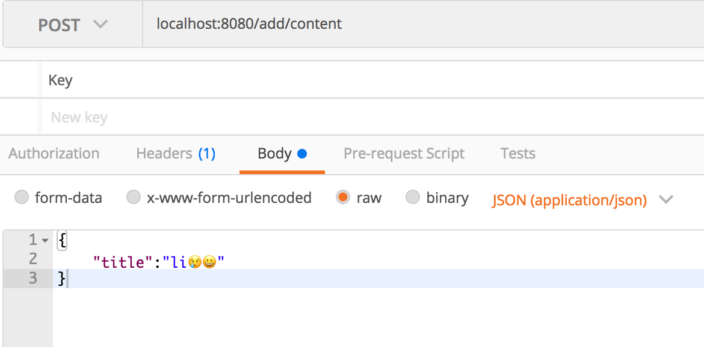
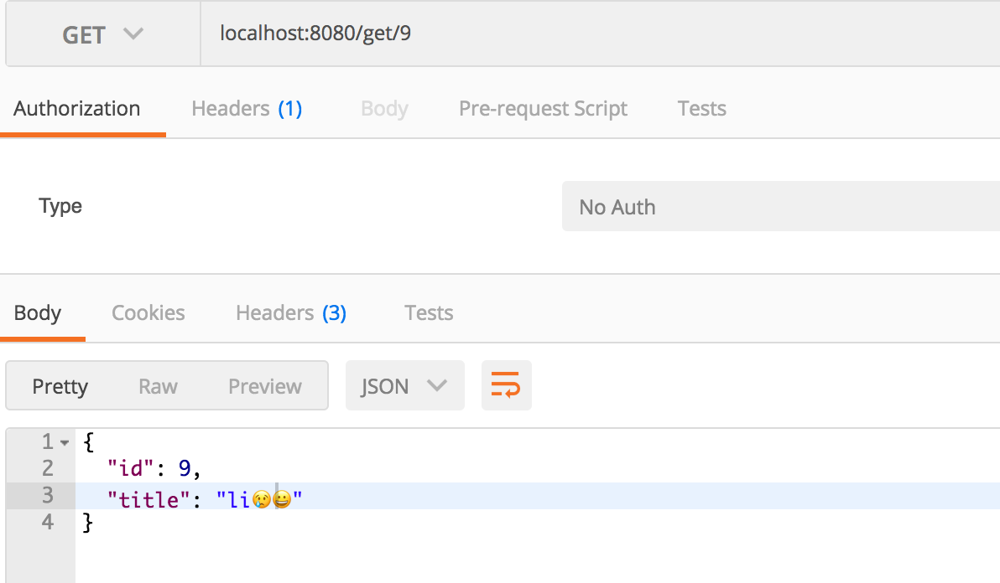

mysql 的 utf8编码的一个字符最多3个字节，但是一个emoji表情为4个字节，所以utf8不支持存储emoji表情。但是utf8的超集utf8mb4一个字符最多能有4字节，所以能支持emoji表情的存储。但是修改这个配置太繁琐了，容易出错，emoji-java这个库可以在代码段解决这个问题，解决思路：

- 页面有一个表情😁，在经过处理之后可以是:smile:,将这个字符存入数据库

- 读取的时候可以将:smile:这个字符转为😁

## 一、引入依赖

```

<dependency>

     <groupId>com.vdurmont</groupId>

     <artifactId>emoji-java</artifactId>

    <version>3.2.0</version>

</dependency>

```

## 二、API使用(常用）

```

 @RequestMapping("/add/content")

    public ResponseEntity insertContent(@RequestBody Content content) {

        String title = content.getTitle();


        String titles = EmojiParser.parseToAliases(title);

        content.setTitle(titles);

        Integer integer = emojiMapper.insertContent(content);

        if (integer == 1) {

            return ResponseEntity.ok().build();

        }

        return  ResponseEntity.badRequest().build();

    }


    @RequestMapping("/get/{id}")

    public Content getById(@PathVariable("id") Integer id) {

        Content content = emojiMapper.selectById(id);

        String title = EmojiParser.parseToUnicode(content.getTitle());

        content.setTitle(title);

        if (content != null) {

            return content;

        }

        return  null;

    }

```

- EmojiParser.parseToAliases(string); 将表情符号转为字符

- EmojiParser.parseToUnicode(string); 将字符转为表情符号


## 三、案例

- 存入表情



- 数据库存储记录


- 查询该记录

